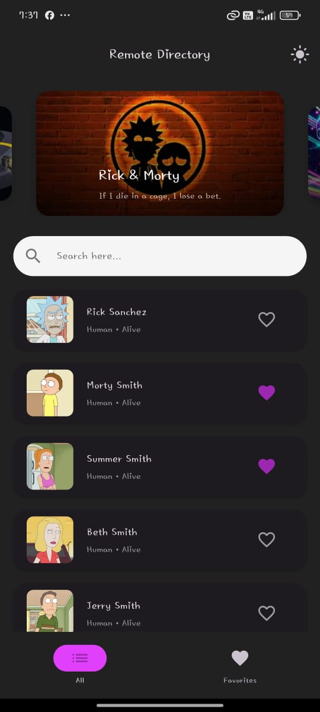
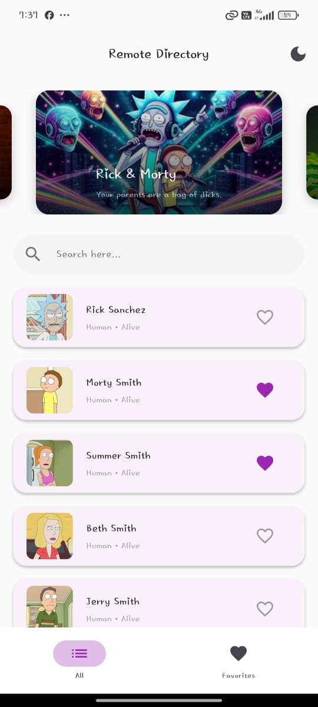
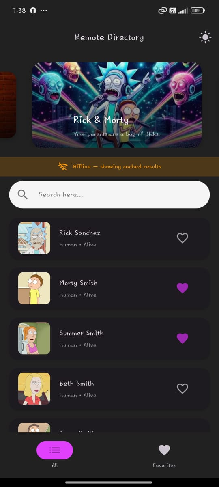
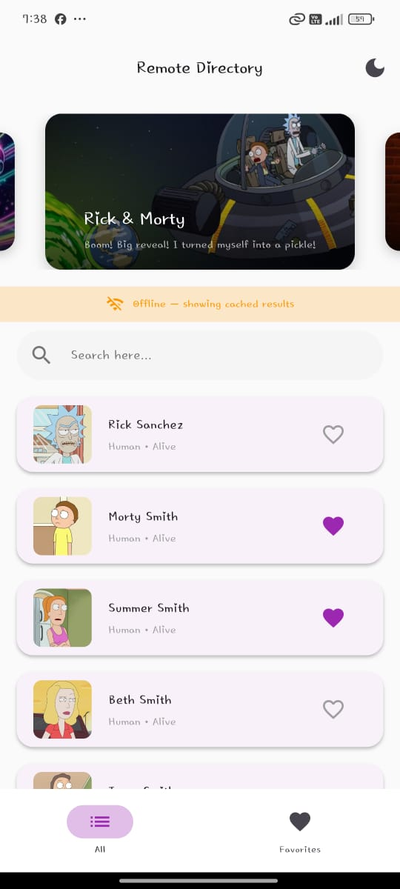
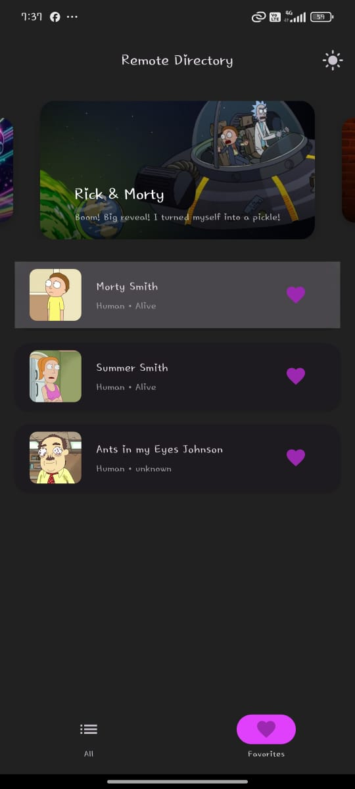
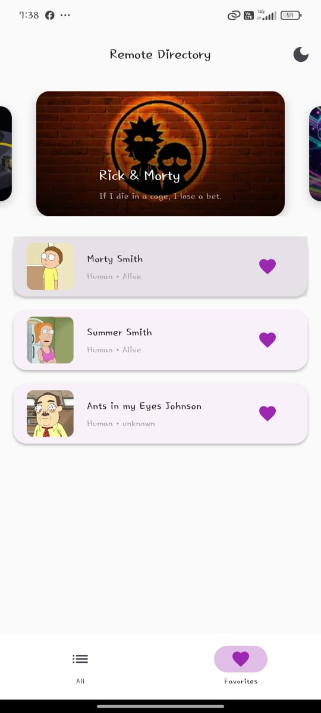
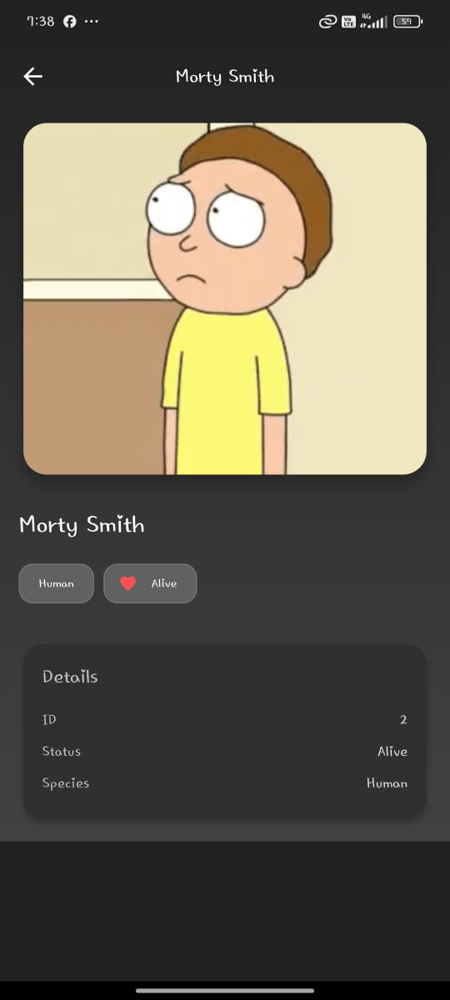
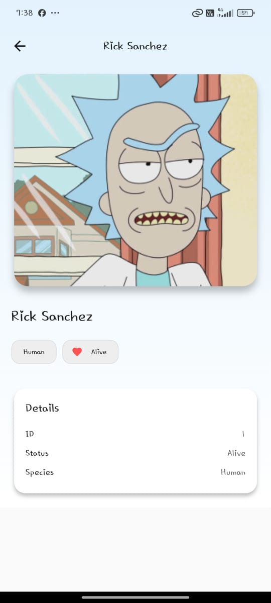

Remote Directory Mobile Application - Rick & Morty

A polished, offline-friendly, Rick & Morty character browser built with Flutter.
It features a splash/landing flow with animations, paginated directory with search, favorites, offline cache, theming, and a detail page.

Features

Fetch and display items
Show: thumbnail/image
Client-side search over the currently loaded items
Tapping an item opens a detail page
If the app opens offline, show cached data with an offline badge
Theming (light/dark switch)
Tap a heart to save an item as favorite

Tech Stack

Flutter (Material 3)
Provider for state management
Dio for HTTP
Hive (hive_flutter) for local cache & favorites
cached_network_image

1) Setup

Prerequisites

flutter version
       Flutter 3.32.8

Get dependencies
   flutter pub get

Android

Android: ensure internet permission in android/app/src/main/AndroidManifest.xml:

<uses-permission android:name="android.permission.INTERNET"/>
Assets

   assets:
     - assets/logo.png
     - assets/background.png
     - assets/bg1.png
     - assets/bg2.png
     - assets/bg3.png

2) API

Rick and Morty API 

Base: https://rickandmortyapi.com/api

class ApiEndpoints {
static const base = 'https://rickandmortyapi.com';
static const characters = '$base/api/character';
}

3) Architecture Overview

This app follows a lightweight layered approach:

data/
  remote/ 
     CharacterApi
  models/ 
     Character
  repository/ 
     CharacterRepository

Returns (List<Character>, bool hasNext)

Handles simple read/write of cache snapshots via Hive 

features/directory/

  application/ 
      DirectoryProvider (ChangeNotifier)
  presentation/ 
      screens & widgets 

core/ theme + endpoint constants

App Flow 
    Splash → Landing → Home

If offline → load cach

4) Screenshots 
 
splash page
  

landing page
  

home page - online
  dark
  
  light
  

home page - offline
  dark
  
  light
  

favorites page
  dark 
  
  light
  

details page 
  dark
  
  light
  

5) Known Limitations 

   items can only add favorite
   item can search with using name 

What I’d Do Next
  
  Server-side search 
  create a sign in and sign up pages
  search through the image or voice
  item rating

